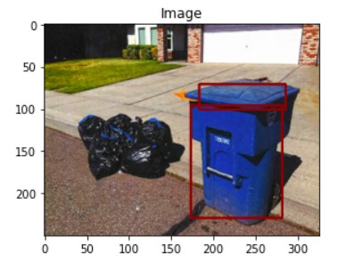
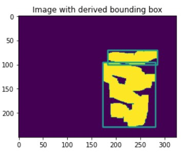
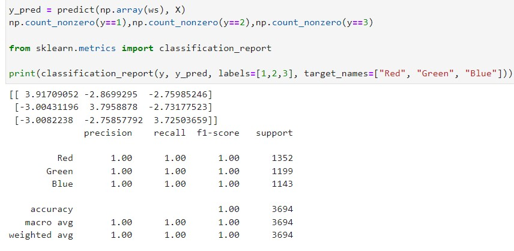

# Color Segmentation and Bounding-Boxes

This project was part of UCSD ECE 276A, Sensing and Estimation coursework (Winter 2021) 

With the Internet of Things (IoT) and Artificial Intelligence (AI) becoming ubiquitous technologies, we now have huge volumes of data being generated. Since the vast amount of image data we obtain from cameras and sensors is unstructured, we depend on advanced techniques such as machine learning algorithms to analyze the images efficiently. Furthermore, classifying pixels forms a fundamental part of a SLAM problem in robotics. It is a method in which a digital image is broken down into
various subgroups called segments which helps in reducing the complexity of the image and thus extract necessary information required to meet a certain objective. This process is generally diving in following categories: Image pre-processing, detection, feature extraction, training and classification.

In this particular project, a supervised pixel classifier based on logistic regression is modelled which is capable of classifying between recycling bin and not a recycling bin, and construct a bounding box around it based on certain rules. The parameters for predicting the labels of new test image are estimated by minimizing the cross entropy loss. Furthermore, using few morphological operations and apply heuristics, a bounding box is created for the test image.

## Screenshots

